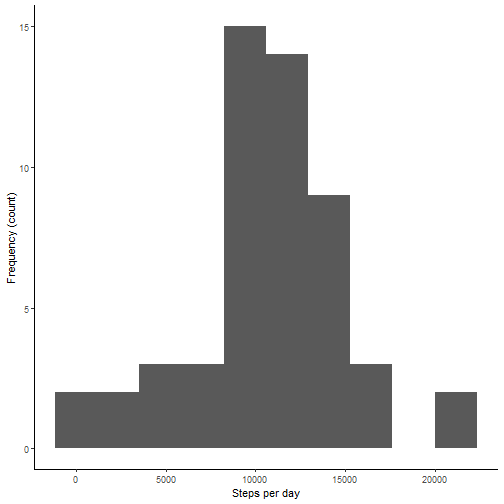
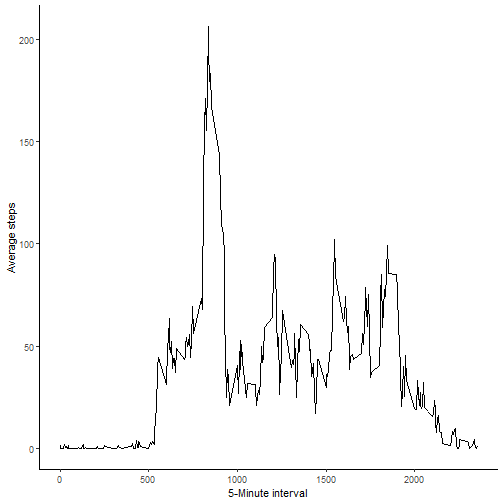
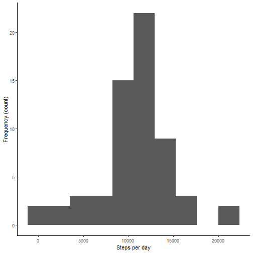
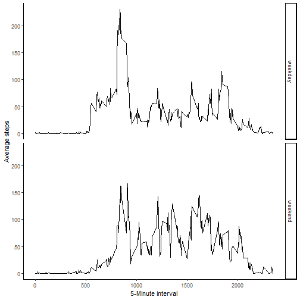

## Loading and preprocessing the data

```r
library(dplyr)
library(ggplot2)
library(Hmisc)

unzip('activity.zip')
raw <- read.csv('activity.csv')
raw$date <- as.POSIXct(raw$date, format = '%Y-%m-%d')
```


## What is mean total number of steps taken per day?

```r
sum_steps <- group_by(raw[complete.cases(raw), ], date) %>%
  summarise(total = sum(steps, na.rm = T))

ggplot(sum_steps, aes(x = total)) +
  geom_histogram(bins = 10) + 
  xlab('Steps per day') +
  ylab('Frequency (count)') + 
  theme_classic()
```



```r
cat('Mean steps taken per day:', mean(sum_steps$total))
```

```
## Mean steps taken per day: 10766.19
```

```r
cat('\n')
```

```r
cat('Median steps taken per day:', median(sum_steps$total))
```

```
## Median steps taken per day: 10765
```


## What is the average daily activity pattern?


```r
daily_pattern <- group_by(raw, interval) %>% 
   summarise(mean = mean(steps, na.rm = T))

ggplot(daily_pattern, aes(x = interval, y = mean)) +
  geom_line() +
  xlab('5-Minute interval') +
  ylab('Average steps') +
  theme_classic() 
```



```r
cat('Interval number', daily_pattern[which.max(daily_pattern$mean), ]$interval, 'contains the maximum mean number of steps:', daily_pattern[which.max(daily_pattern$mean), ]$mean)
```

```
## Interval number 835 contains the maximum mean number of steps: 206.1698
```

## Imputing missing values


```r
cat('There are', sum(is.na(raw)), 'missing values')
```

```
## There are 2304 missing values
```

```r
fill_w_mean <- function(query, ref) {

  imputed <- c()
  for (i in 1:nrow(query)) {
    if (is.na(query[i, 'steps']) == T) { 
      imputed[i] <- ref[ref$interval == query[i, 'interval'], ]$mean
    } else { 
      imputed[i] <- query[i, 'steps']
    }
  }
  
  return(imputed)
}

to_impute <- raw
to_impute <- mutate(to_impute, steps = fill_w_mean(to_impute, daily_pattern))
head(to_impute)
```

```
##       steps       date interval
## 1 1.7169811 2012-10-01        0
## 2 0.3396226 2012-10-01        5
## 3 0.1320755 2012-10-01       10
## 4 0.1509434 2012-10-01       15
## 5 0.0754717 2012-10-01       20
## 6 2.0943396 2012-10-01       25
```

```r
imputed_hist <- group_by(to_impute, date) %>% summarise(total = sum(steps))
imputed_hist$total <- as.integer(imputed_hist$total)

ggplot(imputed_hist, aes(x = total)) +
  geom_histogram(bins = 10) + 
  xlab('Steps per day') +
  ylab('Frequency (count)') +
  theme_classic()
```



```r
cat('Mean steps taken per day after imputing NAs:', mean(imputed_hist$total)) 
```

```
## Mean steps taken per day after imputing NAs: 10766.16
```

```r
cat('Median steps taken per day after imputing NAs:', median(imputed_hist$total)) 
```

```
## Median steps taken per day after imputing NAs: 10766
```


## Are there differences in activity patterns between weekdays and weekends?


```r
weekday_vs_weekend <- to_impute
weekday_vs_weekend$day <- ifelse(as.POSIXlt(weekday_vs_weekend$date)$wday %in% c(1:5), 'weekday', 'weekend')
head(weekday_vs_weekend)
```

```
##       steps       date interval     day
## 1 1.7169811 2012-10-01        0 weekday
## 2 0.3396226 2012-10-01        5 weekday
## 3 0.1320755 2012-10-01       10 weekday
## 4 0.1509434 2012-10-01       15 weekday
## 5 0.0754717 2012-10-01       20 weekday
## 6 2.0943396 2012-10-01       25 weekday
```

```r
weekday_vs_weekend_avg <- weekday_vs_weekend %>% group_by(day, interval) %>% summarise(mean_steps = mean(steps), .groups='drop')
ggplot(weekday_vs_weekend_avg, aes(x = interval, y = mean_steps)) +
  geom_line() +
  facet_grid(day ~.) +
  xlab('5-Minute interval') +
  ylab('Average steps') +
  theme_classic()
```


